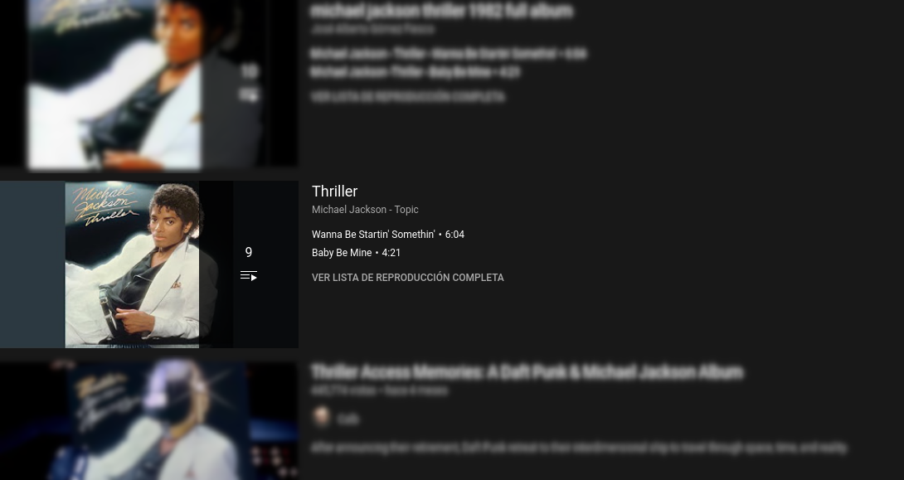
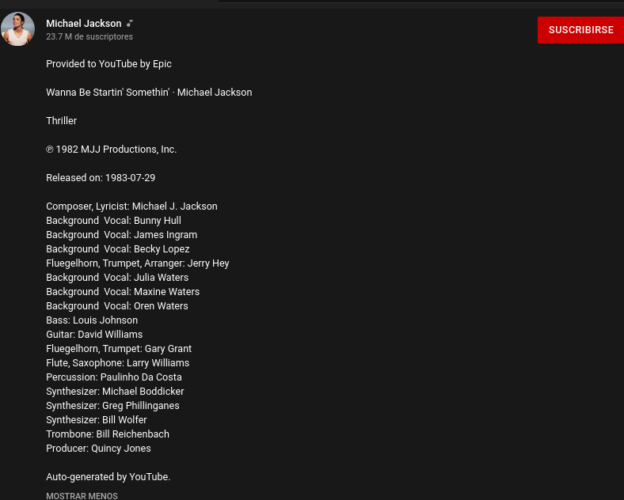
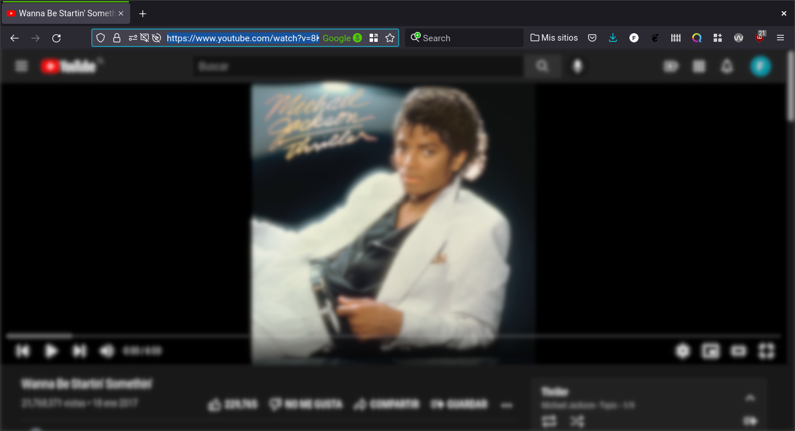
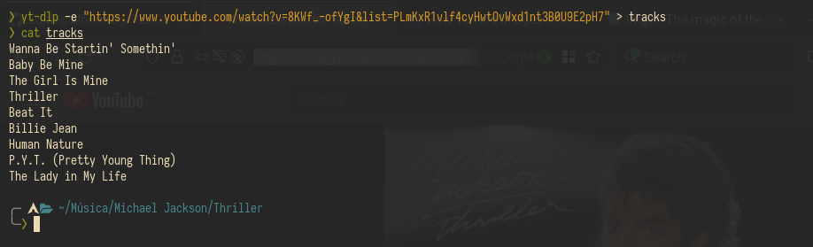
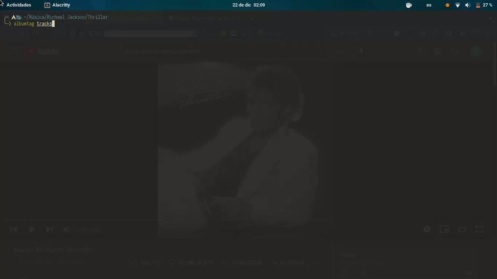
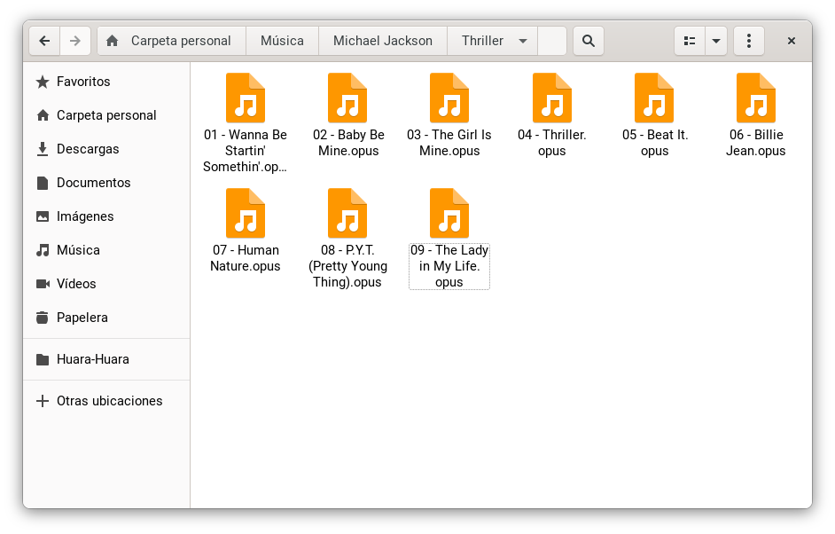
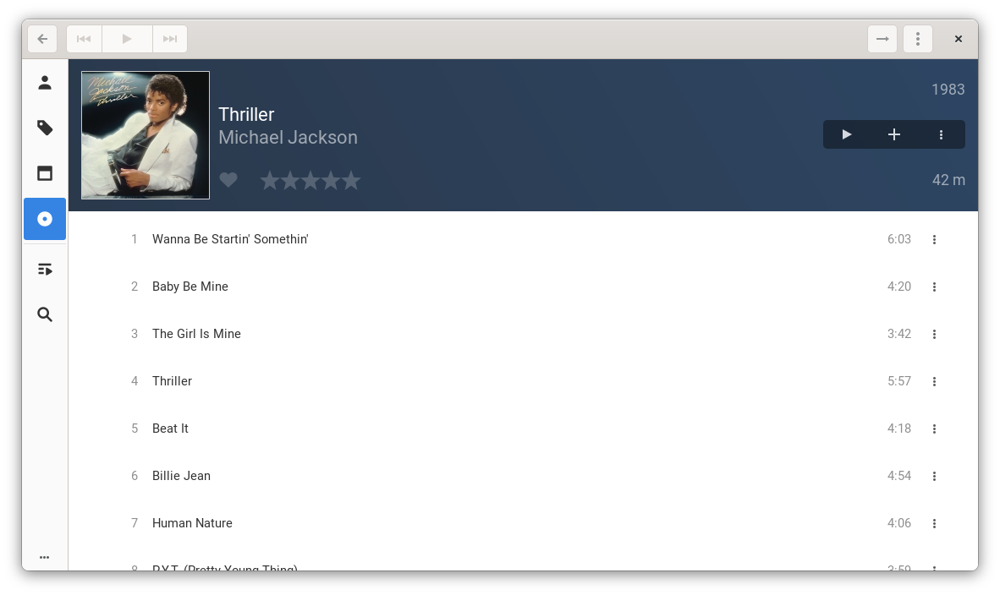

# Albumtag
A POSIX compliant shell script to write metadata to your albums.

## ¿How does it work?
First you have to obtain the album, to do this you have to use `yt-dlp` or `youtube-dl` and download a playlist from youtube. This reason of this is because when an artist release an album, its record label distributes it in different platforms like Spotify, Itunes, Apple Music, etc. One of these platforms is Youtube and it uploads the album in the form of an auto-generated playlist, in other words, **you can find pretty much every album officially in youtube through playlists.**

After downloading the album the script orders the songs according to the track list of the album and renames each one to add a number prefix, then it gives a prompt to the user to write the metadata and applies it to the songs, in order to do this the songs have to have the opus format. This is already done when you use `yt-dlp`, but if you use `youtube-dl` you'll have to convert them to opus, the convertion process is handled by the script when you comment and uncomment some parts of the script which are mentioned in the script itself.

## Installation
```
git clone https://github.com/fMorales-97/albumtag.git
cd albumtag/
chmod +x albumtag
mv albumtag ~/.local/bin
```
## Usage
You start by choosing the album, in this case it'll be Michael Jackson's Thriller.


*If you want to make sure that you'll be downloading the official album, select the playlist whose thumbnail has colored bars at the sides of the album cover. You can further verify that the you've selected the correct playlist by checking the description of the video*



*As you can see, the channel is the artist's official one and at the end of the description it says "Auto-generated by YouTube".*

Then you copy the url of the playlist.



Once that's done, you have to run `yt-dlp -e "your-playlist-url" > tracks` to extract the title of each video of the playlist (which are the track names of the album) and redirect those into a new file called "tracks" that will be necessary later on.



I cat'ed that file to make sure everything is fine.

After having the "tracks" file you can start the download process by typing `yt-dlp --abort-on-error -x --audio-format best --audio-quality 0 "your-playlist-url"` (or `youtube-dl -xf bestaudio/best "your-playlist-url"` if using `youtube-dl`). This will download the audio of each video with the best quality and in opus format. One thing to have in mind is that **you have to write the option** `--abort-on-error` so the download will stop when having an error, this is because the script orders the songs based on creation time before renaming (or converting) them, if you didn't write this option the download would continue to the next song despite having errors and the script **won't be able** to list the songs in the correct album order.

Now that you have your songs downloaded from the playlist is time to run the script. Here's an example of how it works.



When you run it you have to select the "tracks" file you've created, that is used for two things:

1. Extract the total number of tracks in the album.
2. Make sure that the name of every song is correct.

The script will give you the following results.





Every song is organised and renamed as in the album and the music player (lollypop in my case) recognises the written metadata.

## Dependencies
* `yt-dlp` or `youtube-dl` if you can't get the first one.
* `opustags`. The program that's used to write the metadata.
* `gst-libav` and `gst-plugin-base`. Those are the ogg codecs necessary to play opus files.

## General recommendations
If you have the possibility, use `yt-dlp` instead of `youtube-dl`, the download times are much faster in the former than in the latter, when I used `youtube-dl` to download a 11 song album it took like 17 minutes, but when using `yt-dlp` I got it in 20 seconds. It also has more options to download videos. Another reason is because it handles the portion of url inserted in the filenames much better than `youtube-dl`, so it's more easy to deal with (a more detailed explanation in the section below).

When you download a playlist, the songs will appear where you currently are, so I recommend you to create a folder with the artist's name inside your music directory and then another one with the name of the album inside the artist folder, `cd` into it and then download the playlist.

The "tracks" file can be named however you want, it's just a descriptive name that I use.

## Known issues and solutions
* Because of how the Linux filesystem works, if one or more songs have a slash in the name `yt-dlp` will replace it with an underscore, the same applies if the file has a colon in the name. Even though this cannot be changed in the filename, it can be changed in the metadata after running the script with the following command `EDITOR=vim opustags --in-place --edit 'name of the song.opus'`. This is the second reason why the creation of the "tracks" file is necessary, this way you'll know beforehand when a song has those characters. *You can use whatever editor you want, it doesn't have to be vim.*
* If you are using `youtube-dl` and you have an album which has any number of songs with dashes in the name, the renaming and metadata writing process **won't be effective** on those songs. This is because when you download a playlist with `youtube-dl` the resulting files have a dash after the name followed by a portion of the videos's url, like this "Name of the song-YkjhHhfh045akjsf.m4a", so, in order to remove that portion of url, the script will delete every character from the dash until the dot of the file extension. As you can imagine, if you have a song with a name like this "Name-of-the-song-YkjhHhfh045akjsf.m4a" the script will delete from the first dash (the one after "Name") until the file extension, the only solution I can think of is to rename the file manually after the script is done and also rewriting the metadata title with this command `EDITOR=vim opustags --in-place --edit 'name of the song.opus'`. This is why **is highly recommended to use yt-dlp** since it wraps the url with square brackets, making the task of deleting the url much more safe.
* The script doesn't separate songs of albums with multiple discs automatically, so, if you have an album with more than one disc (for example "The Wall" by Pink Floyd), you have two options:
  1. After the download has completed, create a subdirectory for each disc, then manually move the songs corresponding to each disc into their respective folders and run the script in each folder, when promted the question if the album has more than one disc type `y` and type the disc number. **Don't forget** that you have to create another "tracks" file and cut/paste the name of the songs corresponding to other discs, then move those files into their corresponding folders.
  2. You can select a range of videos to download from a playlist, so, if you were to download the album "The Wall" which has 26 songs (13 per disc) you could type `yt-dlp --abort-on-error -x --audio-format best --audio-quality 0 --playlist-items 1,13 "playlist-url"` move those files to the corresponding subdirectory and then type `yt-dlp --abort-on-error -x --audio-format best --audio-quality 0 --playlist-items 14,26 "playlist-url"` to get the remaining songs (don't forget to move them to their subdirectory), and finally run the script in each folder. Again, you have to repeat the process with the "tracks" file that's mentioned above. *This method doesn't work when using `youtube-dl` since it doesn't have the option to download portions of a playlist, another reason to use `yt-dlp`.*
* These official auto-generated playlist are not perfect so there's a low chance that you end up with a playlist that has a random video in between, if this is the case you can (again) select a ranges of videos to download, like so `yt-dlp --abort-on-error -x --audio-format best --audio-quality 0 --playlist-items 1-5,7-26 "playlist-url"`, this way you can download from the first to the fifth video, skip the sixth, and continue from the seventh until the end. *Once again, this doesn't work when using `youtube-dl`.*

## Questions and answers
Q: ¿Why do I have to use the opus format?

A: Because it has much better sound quality with similar (if not better) compression rates than mp3, and it's easier to create and edit the metadata with the program `opustags`

Q: ¿Does it work in any distro?

A: Since it's a POSIX compliant shell script and as long as you have the dependencies mentioned above, you shouldn't have any problems, although I haven't tested it in any distro other than Arch Linux. Keep in mind that the dependencies names may change depending on the distro so check the availability of those before running this script.

Q: ¿How can I get the album covers?

A: For the album covers I use the music player `lollypop` because it can search for the covers in the Spotify database, as well as AudioDB, iTunes, and others, then you select the cover you want to use and it downloads it to that album directory. This works when you have a properly written metadata in your songs.

Q: ¿Do I have to always type those long commands?

A: Not at all, you can use aliases, for example in my `.zshrc` I've written `alias yta="yt-dlp --abort-on-error -x --audio-format best --audio-quality 0"` and also `alias etags="EDITOR=vim opustags --in-place --edit"` so feel free to do the same.

Q: ¿What do I do when the song title is so long that it has ellipses?

A: If the name of the song is that long (as in the case of some song names of some 70's progressive rock bands) not even the "tracks" file will help because the names in that file comes from the title of the playlist videos, the best thing you can do is look at the name of the song in the description of the video, it will always be complete there.
